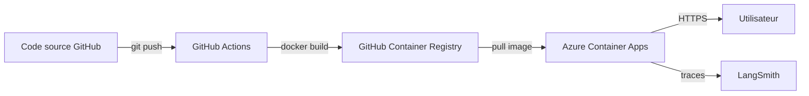

## Déploiement

L'agent est déployé en production et accessible publiquement :

🔗 **[Financial Analysis Agent — Live Demo](https://financial-agent.livelybay-b439f1f5.swedencentral.azurecontainerapps.io/)**

### Architecture de déploiement

### Pipeline CI/CD

1. **GitHub Actions** : à chaque push sur `main`, un workflow construit automatiquement l'image Docker et la publie sur **GitHub Container Registry (ghcr.io)**
2. **Azure Container Apps** : récupère l'image depuis ghcr.io et héberge l'application avec mise à l'échelle automatique (0 à 10 réplicas selon le trafic)
3. **Variables d'environnement** : les clés API (`OPENAI_API_KEY`, `LANGCHAIN_API_KEY`) sont gérées de manière sécurisée via les secrets Azure Container Apps, jamais incluses dans l'image Docker
4. **Monitoring** : LangSmith trace chaque appel d'outil en production (paramètres, tokens, latence, erreurs)

### Stack de déploiement
- **Docker** : containerisation de l'application
- **GitHub Actions** : intégration et déploiement continus (CI/CD)
- **GitHub Container Registry (ghcr.io)** : registre d'images Docker
- **Azure Container Apps** : hébergement serverless avec scaling automatique